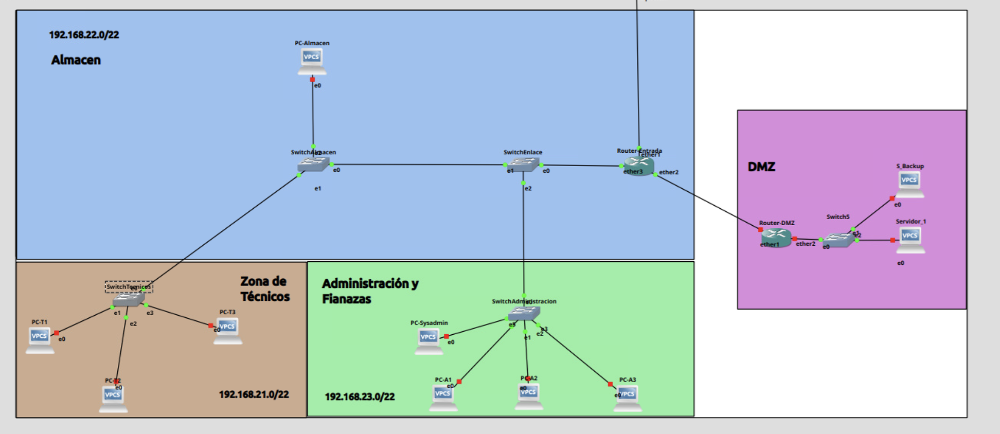
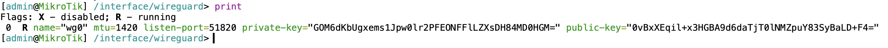
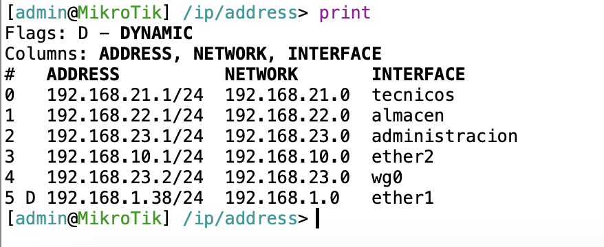
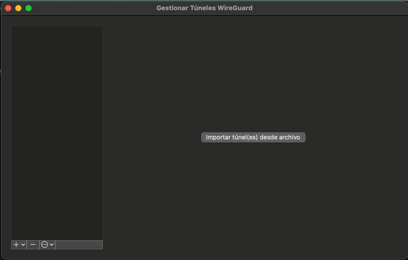
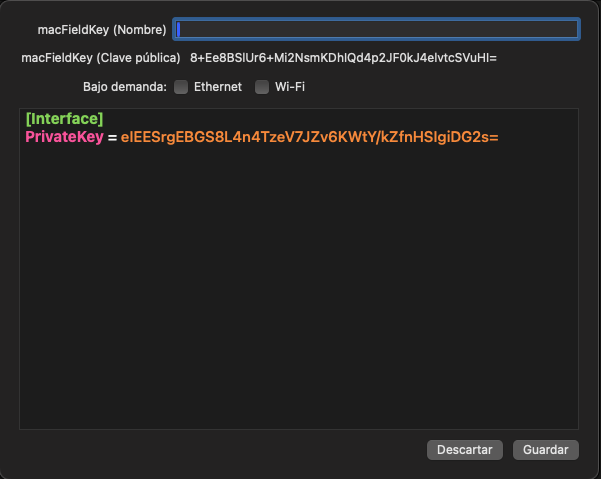
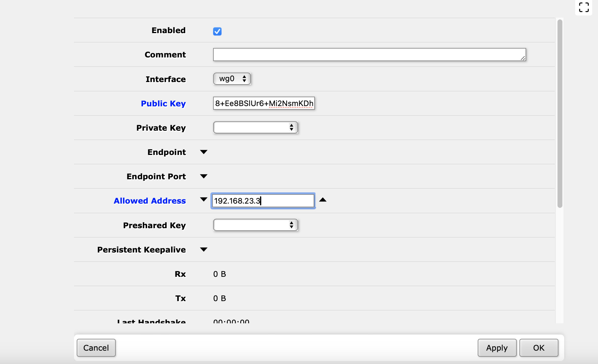

# Proyecto Final de CFGS de José Ramón Peris Murcia 2º ASIR

1. [Introducción](#Introducción)
    1. [¿Qué es lo que busca el cliente?](#----que-es-lo-que-nos-pide-el-cliente-----mejorar-el-titulo)
2. [Montaje de la infraestructura de red](#montaje-de-la-infraestructura-de-red)
    1. [Presupuesto del proyecto](#presupuesto-del-proyecto)
    2. [Configuración de la red](#configuración-de-la-red)
        1. [Configuración de los routers](#configuración-de-los-routers)

## Introducción

En este proyecto vamos a realizar la infraestructura de una empresa, en este caso será una empresa encargada de suministros escolares, material de oficina y reprografía (Gestión y reparación de máquinas fotocopiadoras).

Para ello nos vasaremos en los planos de la nave donde se encuentra la empresa y buscaremos **la mejor opción posible para realizar nuestro proyecto**.



Como vemos en el plano de generado en GNS3 nos encontramos con una nave de **dos plantas**. En la primera planta nos encontramos con toda la parte del **almacen** donde se aloján los suministros escolares. El **departamento de técnicos de las máquinas fotocopiadoras**, donde se encargarán de la reparación y configuración de las máquinas fotocopiadoras y la zona donde ubicaremos la **DMZ**.

En la primera planta se ubicará **el departamento de admininstración y finanzas**.

### ----¿Que es lo que nos pide el cliente?-----(Mejorar el titulo)

*El cliente busca que realicemos una actualización de su infraestructura de red y una digitalización del almacen, de la zona de técnicos y administración.*

Para ello nostros les planteamos las siguientes propuestas:

- Levantar una infraestructura de red mediante la configuración de routers Mikrotik que realizará la salida de internet, firewall y portforwarding.

- La creación de una aplicación web que permita hacer consultas sobre el stock que contiene el almacen de suministros y el stock de piezas para los técnicos.

- La implantación de una aplicación de tareas para que los técnicos puedan realizar un seguimiento de las máquinas desde que entran al taller hasta que salen del mismo.

- Desarrollo de una solución de almacenamiento de datos que permita la no dependencia de servicios de nube como Dropbox o Google Drive.

- La construcción de una DMZ que permita tener dos servidores encargados de los servicios implementados

- La implantación de una VPN que permita acceder a estos servicios.

La empresa acepta nuestra propuesta y nos pondremos **"Manos a la obra"**

## Montaje de la infraestructura de red

El primer paso que vamos a realizar es el montaje de la infraestructura de la red. Este consistirá en los siguientes puntos:

- El montaje de un sistema de routers **Mikrotik** que se encargue del *enrutamiento de la infraestructura de la empresa.*

- Implantación de un servicio de **DNSMasq** responsable de *la asignación de los dns y el dhcp.*

- Configuración del **portforwarding** de los routers, buscando *una mayor seguridad y la redirección de los servicios a nuestra DMZ.*

- Compra y preparación de equipos para almacen, técnicos así como administración y dmz.

### Presupuesto del proyecto

Después del estudio que hemos realizado en la nave, nos encontramos con que el *tema de infraestructura de cableado a sido montada con anterioridad al tratarse de una nave moderna.* Por lo tanto nosotros presupuestaremos tanto los equipos nuevos, la DMZ, y el tratamiento de switches, routers, etc.

Aquí nos encontramos con el presupuesto que le hemos realizado a la empresa con todos sus enlaces en la web de **PcComponentes**:

| Modelo | Cantidad | Precio Unidad | Enlace |
|:------:|:--------:|:-------------:|------|
| Armario Rack 19" 22U 600x600 (Para DMZ) |  1 |   413,67€   |[Comprar](https://www.pccomponentes.com/armario-rack-19-22u-600x600?utm_source=531573&utm_medium=afi&utm_campaign=shopforward.nl&sv1=affiliate&sv_campaign_id=531573&awc=20982_1716742105_4386269844ea01d5a9218daa611daf51&utm_term=deeplink&utm_content=25082.Cj0KCQjwu8uyBhC6ARIsAKwBGpSQPnuLyLwCtWH3D-_6RvKMMFQPTFny4pVcGFAZUzhE5W9CqmC1W5AaAsp_EALw_wcB)|
| VidaXL Armario Rack 19" 12U 600x640mm (Para administración) | 1   | 148,98€  |[Comprar](https://www.pccomponentes.com/vidaxl-armario-rack-19-12u-600x640mm?utm_source=531573&utm_medium=afi&utm_campaign=shopforward.nl&sv1=affiliate&sv_campaign_id=531573&awc=20982_1716742054_91b2a72c9893094b43aeeccc211d676d&utm_term=deeplink&utm_content=25082.Cj0KCQjwu8uyBhC6ARIsAKwBGpRdj6UrKEbh_rgSWqzv1DDvmSA3wRlq9MszeB_RlaJcYq-nWxEXADwaAqzTEALw_wcB)|
| VidaXL Armario Rack 19" 6U 600x450x375mm  | 3   | 96,99€ |[Comprar](https://www.pccomponentes.com/vidaxl-armario-rack-19-6u-600x450x375mm?utm_source=531573&utm_medium=afi&utm_campaign=shopforward.nl&sv1=affiliate&sv_campaign_id=531573&awc=20982_1716742063_d5438b74e1ac4e3cba6a08ad1bab3d2c&utm_term=deeplink&utm_content=27932.Cj0KCQjwu8uyBhC6ARIsAKwBGpR11uxnDf4huC_xA1SgIRFAKPqfaK_BeLPBwxaF_hS2rL4J5qdqCeMaAgmyEALw_wcB)|
|Mikrotik RB1100AHx4 Router Ethernet 13 Puertos RJ45 Gigabit PoE | 2 | 314,39€ |[Comprar](https://www.pccomponentes.com/mikrotik-rb1100ahx4-router-ethernet-13-puertos-rj45-gigabit-poe)|
| TP-Link TL-SG1024DE Switch 24 Puertos Gigabit | 5 | 107,43€ |[Comprar](https://www.pccomponentes.com/tp-link-tl-sg1024de-switch-24-puertos-gigabit?utm_source=531573&utm_medium=afi&utm_campaign=shopforward.nl&sv1=affiliate&sv_campaign_id=531573&awc=20982_1716742507_4e25f87295e75b24d972fe659c5435b5&utm_term=deeplink&utm_content=11894.Cj0KCQjwu8uyBhC6ARIsAKwBGpQNMki_9xVS9lmNUM4YVDgASzJW0sPfgHJ1tzq1_vXMTUv00pNjXpsaAmmBEALw_wcB)|
| Equip 326424 Patch panel 24 Puertos Cat 6 | 5 | 79,65€ |[Comprar](https://www.pccomponentes.com/equip-326424-panel-de-parcheo-24-puertos-cat-6)|
| Dell PowerEdge R350 Intel Xeon E-2314/16GB/600GB  | 3 | 1699,00€ | [Comprar](https://www.pccomponentes.com/dell-poweredge-r350-intel-xeon-e-2314-16gb-600gb?utm_source=531573&utm_medium=afi&utm_campaign=shopforward.nl&sv1=affiliate&sv_campaign_id=531573&awc=20982_1716742606_5a39c8a66215f2a7a5db017c7dcee381&utm_term=deeplink&utm_content=717.Cj0KCQjwu8uyBhC6ARIsAKwBGpQMeBHuC80RNCs4UzuRrZbxDQ-PsbGrZ2maCkwp8ppcUHiTgIGlu1oaAhuMEALw_wcB)|
| HP Pavilion All-in-One 27-ca2008ns Intel Core i5-13400T/16GB/512GB SSD/27" (Equipos de trabajo) | 7 | 899,01€ |[Comprar](https://www.pccomponentes.com/hp-pavilion-all-in-one-27-ca2008ns-intel-core-i5-13400t-16gb-512gb-ssd-27?s_kwcid=AL!14405!3!!!!x!!&gad_source=1&gclid=Cj0KCQjwu8uyBhC6ARIsAKwBGpQvVMRSji4wCRDVypftl-USqlGeUqZLbilSEix2VwgitTBOOjG1aFwaAnOwEALw_wcB)|
|Dell Vostro 3520 Intel Core i5-1235U/16GB/512GB SSD/15.6" (Portatiles de backup)|3|639,00€ |[Comprar](https://www.pccomponentes.com/dell-vostro-3520-intel-core-i5-1235u-16gb-512gb-ssd-156?utm_source=624709&utm_medium=afi&utm_campaign=www.twenga-solutions.com&sv1=affiliate&sv_campaign_id=624709&awc=20981_1716742876_68a3fdd1d2d05c9f5a7d5f14ed57f07d&utm_term=deeplink&utm_content=ac5f26529b84508e0911daf7189909c5)|
|-|-|-|-|
|-|-|**Total: 15872,87€ IVA Incuido**|-|

### Configuración de la red

Ahora toca la configuración de la red. En este caso se realizará la configuración con unos routers de la marca **Mikrotik** que utilizan el sistema operativo *Router OS* que permite una gran configuración y personalización.

Para ello se realiza la configuración de los **2 routers** que se han comprado.

- Uno será el router de entrada/salida de internet.

- El otro será un router será el encargado de separar a la  **DMZ** del resto de equipos. Haciendo una separación clara entre ellas.

A parte de todo esto, se creará diferentes VLANs que aportará una mayor seguridad, eficiencia y mejor gestión de las redes.

#### Configuración de los routers

Para configurar los routers se dividirá en dos partes:

- Configuración de la **red interna de la empresa**, en la que entrará todo el apartado de las *VLAN* y la salida a internet de los equipos.

- Configuración de la **DMZ**, donde se alojará los servidores y comprende el apartado de comuncicación entre los dos routers y la redirección de puertos.

***Falta configuracion de puertos y del router


#### Parte VPN

Ahora que están los routers configurados y totalmente funcionales, llega el momento a montar una VPn. Una VPN es una herramienta de red que nos permite hacer una extensión de nuestra red local. Esto es muy útil porque gracias a esto se podrá entrar a nuestra red interna desde cualquier lugar. Además, solo estará abierto el puerto de la VPN desde afuera ya que solo se puede entrar a los servidores desde la red interna como se ha realizado anteriormente en la configuración de los routers, proporcionandonos, una mayor seguridad al proyecto.

La VPN elegida para esta ocasión es **Wireguard**. **Wireguard** es una VPN creada en 2015, de código abierto y bastante popular en la comunidad. Una de las principales razones por las que hemos elegido **Wireguard** es la integración de esta VPN dentro de Mikrotik de manera nativa dentro de su S.O. *RouterOS* dando la fácilidad de configuración dentro del router. Dicho esto comienza la configuración.

1. Actualizar el Router y creación de la interfaz de Wireguard

El primer paso será realizar una actualización del router. Para eso comienza en:

```bash
# Busca si hay actualizaciones
/system package update check-for-updates
# Actualiza el S.O.
/system package update install
```

Después de tener el sistema operativo actualizado, tocará crear la interfaz de la VPN y su red interna.

***¡Muy importante!***. **Está configuración ha sido realizada con fines explicativos. Las claves públicas y privadas mostradas en este proyecto, ya no existen porque representarían un agujero de seguridad importante.**

```bash
# Esto a parte de hacer la interfaz de la vpn,creará una private y public key del servidor.
/interface/wireguard add name=wg0 listen-port=51820
```



```bash
# Creando la red de la VPN
/ip/adress add address=192.168.23.2/24 network=192.168.23.0 interface=wg0
```



Con esto ya estaría creada la interfaz de **Wireguard**

2. Configuración del Firewall

Continua con la configuración del firewall del router con el objetivo de que no solo se pueda entrar a nuestra red interna vía VPN.

```bash
# Bloquea cualquier acceso a la red
/ip/firewall/filter add chain=forward action=drop
# Permite el acceso tanto UDP como TCP el puerto configurado de nuestra VPN
/ip/firewall/filter add chain=input action=accept protocol=udp dst-port=51820
/ip/firewall/filter add chain=input action=accept protocol=tcp dst-port=51820
# Habilita el acceso a internet al igual que hemos echo con las vlan creadas antes
/ip/firewall/nat add chain=srcnat action=masquerade out-interface=wg0
```

3. Creción de la peer

Ahora es el momento de la creación de la parte de *peer*. La primera parte será descargar [el cliente de wireguard](https://www.wireguard.com/install/) (En este caso el cliente de MACOSX). Después de instalar la aplicación, hay que hacer click en **crear un tunel vacio**, después se dentro de esta opción el nombre de la interfaz será el de la VPN "wg0" y se copia la clave pública.





Ahora en la web de *Mikrotik* en el apartado **Wireguard/Peers** se crea una nueva peer.



- Interface: Interfaz que utliza la peer. En este caso "wg0".

- Public Key: La clave pública del cliente de Wireguard.

- Allowed Address: La red que utilizará el cliente.

Después de configurar la Peer se generá un código QR que se puede utilizar en el cliente para móviles. Pero en este caso la configuración se realizará de forma manual.


4. Configuración del cliente

